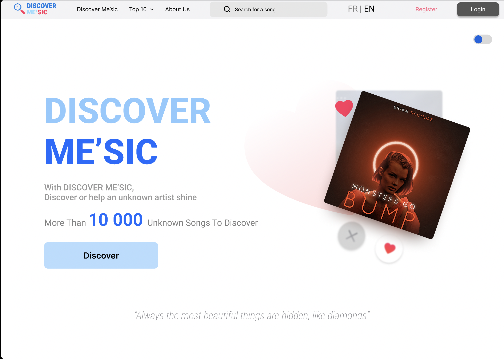
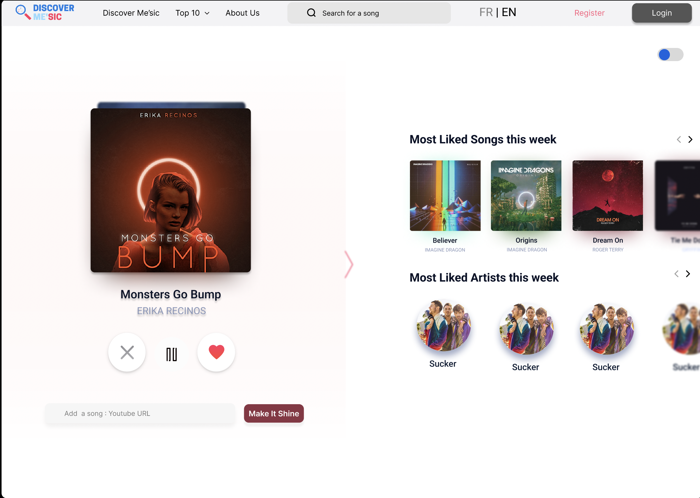
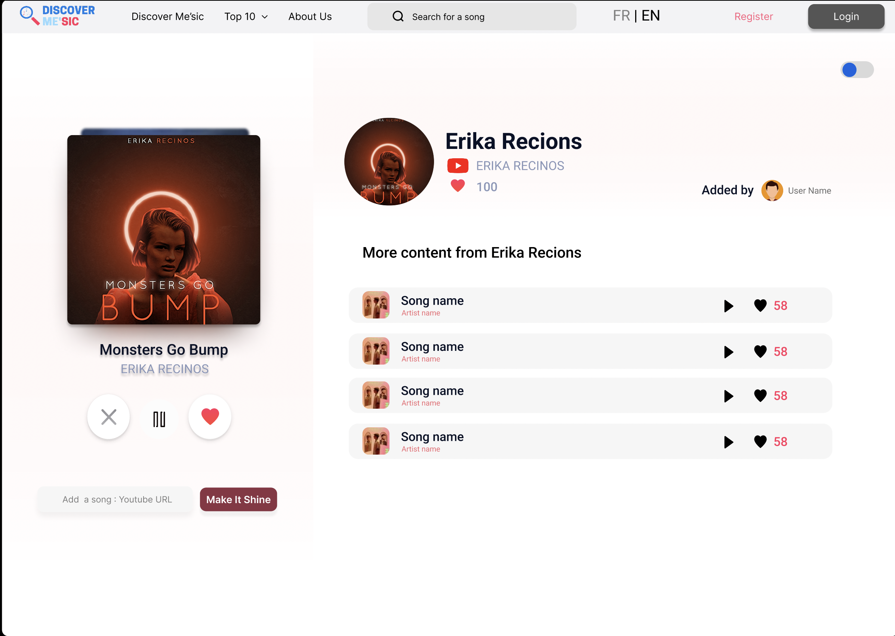

<div align="center">

  
  <h1>Discover Me'sic</h1>
  
  <p>
    A platform to discover and introduce unknown artists and music. 
  </p>
  
  
<!-- Badges -->
<p>
  <a href="https://github.com/CodeOne45/discover-mesic/graphs/contributors">
    
  </a>
  <a href="">
    
  </a>
  <a href="https://github.com/CodeOne45/discover-mesic/network/members">
    
  </a>
  <a href="https://github.com/CodeOne45/discover-mesic/stargazers">
    
  </a>
  <a href="https://github.com/CodeOne45/discover-mesic/issues/">
    
  </a>
  <a href="https://github.com/CodeOne45/discover-mesic/blob/master/LICENSE">
    
  </a>
</p>
   
<h4>
    <a href="https://github.com/CodeOne45/discover-mesic/">View Demo</a>
  <span> · </span>
    <a href="https://github.com/CodeOne45/discover-mesic">Documentation</a>
  <span> · </span>
    <a href="https://github.com/CodeOne45/discover-mesic/issues/">Report Bug</a>
  <span> · </span>
    <a href="https://github.com/CodeOne45/discover-mesic/issues/">Request Feature</a>
  </h4>
</div>

<br />

<!-- Table of Contents -->
# :notebook_with_decorative_cover: Table of Contents

- [About the Project](#star2-about-the-project)
  * [Screenshots](#camera-screenshots)
  * [Tech Stack](#space_invader-tech-stack)
  * [Features](#dart-features)
  * [Environment Variables](#key-environment-variables)
- [Getting Started](#toolbox-getting-started)
  * [Prerequisites](#bangbang-prerequisites)
  * [Installation](#gear-installation)
  * [Running Tests](#test_tube-running-tests)
  * [Run Locally](#running-run-locally)
  * [Deployment](#triangular_flag_on_post-deployment)
- [Roadmap](#compass-roadmap)
- [Contributing](#wave-contributing)
  * [Code of Conduct](#scroll-code-of-conduct)
- [FAQ](#grey_question-faq)
- [License](#warning-license)
- [Contact](#handshake-contact)
- [Acknowledgements](#gem-acknowledgements)

  

<!-- About the Project -->
## :star2: About the Project

A platform to discover and introduce unknown artists and music.

Based on the youtube player, Discover Me'sic allows you to add unknown music with a youtube link and also to listen to the music in order to discover new artists who are not mainstream.

<!-- Screenshots -->
### :camera: Screenshots

<div align="center"> 
  
  
  

</div>


<!-- TechStack -->
### :space_invader: Tech Stack

<details>
  <summary>Client</summary>
  <ul>
    <li><a href="https://nextjs.org/">Next.js</a></li>
    <li><a href="https://reactjs.org/">React.js</a></li>
  </ul>
</details>

<details>
  <summary>Server</summary>
  <ul>
    <li><a href="https://expressjs.com/">Express.js</a></li>
  </ul>
</details>

<details>
<summary>Database</summary>
  <ul>
    <li><a href="https://www.mongodb.com/">MongoDB</a></li>
  </ul>
</details>

<details>
<summary>DevOps</summary>
  <ul>
    <li><a href="https://www.docker.com/">Docker</a></li>
  </ul>
</details>

<!-- Features -->
### :dart: Features

- Add a song with Youtube URL (less than 50k views)
- Listen to known songs randomly
- Export your unknown artist playlist to your favorite streaming platforms

<!-- Color Reference -->
### :art: Color Reference

| Design (Figma)             |

<a href="https://www.figma.com/file/om9iBQYrCXpqjL0W3h2eLV/Discover-Me'sic-team-library?node-id=426%3A30&t=OSJPpZp0uLapM7Cy-1"> Discover Me'sic UI Mockup</a>


<!-- Env Variables -->
### :key: Environment Variables

To run this project, you will need to add the following environment variables to your .env file

``MONGODB_URI``

``YOUTUBE_VIEW_API``
``YOUTUBE_VIEW_API_KEY``
``YOUTUBE_VIEW_API_HOST``

``MONGO_USERNAME``
``MONGO_PASSWORD``
``NEXT_PUBLIC_API_URL``

``CLOUD_NAME``
``CLOUD_API_KEY``
``CLOUD_API_SECRET``

``SENDGRID_API_KEY``
``FROM_EMAIL``

``CLIENT_ID``
``CLIENT_SECRET``

<!-- Getting Started -->
## 	:toolbox: Getting Started

<!-- Prerequisites -->
### :bangbang: Prerequisites

This project uses Yarn as package manager but the app is also docorized 

```bash
 npm install --global yarn
```

or

```bash
 docker-compose build
```


<!-- Installation -->
### :gear: Installation - Next.js App

Install app with npm

```bash
  yarn install app
  cd app
```
   
<!-- Running Tests -->
### :test_tube: Running Tests

To run tests, run the following command

```bash
  yarn test test
```

<!-- Run Locally -->
### :running: Run Locally

Clone the project

```bash
  git clone https://github.com/CodeOne45/discover-mesic.git
```

Go to the project directory

```bash
  cd app
```

Install dependencies

```bash
  yarn install
```

Start the server

```bash
  yarn start
```


<!-- Deployment -->
### :triangular_flag_on_post: Deployment

To deploy this project run

```bash
  yarn deploy
```


<!-- Roadmap -->
## :compass: Roadmap

<a href="https://www.notion.so/discover-mesic/Roadmap-ba008969be5d4b5b9f139a1b83f14523"> Roadmap </a>

<!-- Contributing -->
## :wave: Contributing

<a href="https://github.com/CodeOne45/discover-mesic/graphs/contributors">
  
</a>


Contributions are always welcome!

See `contributing.md` for ways to get started.


<!-- Code of Conduct -->
### :scroll: Code of Conduct

Please read the [Code of Conduct](https://github.com/CodeOne45/discover-mesic/blob/master/CODE_OF_CONDUCT.md)

<!-- FAQ -->
## :grey_question: FAQ

NaN

<!-- License -->
## :warning: License

Distributed under the no License. See LICENSE.txt for more information.


<!-- Contact -->
## :handshake: Contact

Project Link: [https://github.com/CodeOne45/discover-mesic](https://github.com/CodeOne45/discover-mesic)

Notion Roadmap : <a href="https://www.notion.so/discover-mesic/Roadmap-ba008969be5d4b5b9f139a1b83f14523"> Roadmap </a>

Website: www.discovermesic.live

